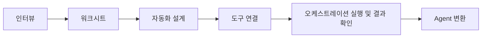

# 참고: 중급 자동화 흐름 도식화

이 문서는 현재 스킬의 흐름을 그림으로 다시 확인하기 위한 참고 문서입니다.

## 1. 전체 흐름

## 2. 단계별 핵심 질문

### 인터뷰

- 이 업무는 누구를 위한 것인가
- 언제 시작되는가
- 무엇을 입력받는가
- 무엇을 출력하는가

### 워크시트

- 인터뷰 답변을 한 장으로 정리할 수 있는가
- 빠진 정보는 무엇인가

### 자동화 설계

- 어떤 순서로 처리되는가
- 어디서 사람이 검토해야 하는가
- 예외는 어떻게 처리하는가

### 도구 연결

- 현재 작업공간에서 실제로 찾은 스킬은 무엇인가
- 즉시 사용 가능한가
- 추가 설정이 필요한가
- 아예 없는 기능인가

### 실행 및 결과 확인

- 지금 바로 실행 가능한 입력 자료가 있는가
- 실제 실행과 드라이런 중 무엇을 할 것인가
- 결과를 어떻게 확인할 것인가

### Agent 변환

- 실행 순서를 Agent 지시 구조로 옮길 수 있는가
- 사람 개입 지점이 Agent 정의 파일에 반영됐는가
- 실제로 호출할 최소 검증 방법이 정리됐는가

## 3. 핵심 산출물

- 인터뷰 메모
- 워크시트
- 자동화 설계 초안
- 도구 연결표
- 실행/결과 확인 메모
- Agent 정의 파일

## 4. 기억할 원칙

- 복잡한 폴더 구조를 먼저 만들지 않는다
- 현재 작업공간에서 실제로 찾은 스킬만 연결한다
- 없는 기능은 `그레이 영역`으로 남긴다
- 내부 참고 문서를 사용자에게 그대로 설명하지 않는다
